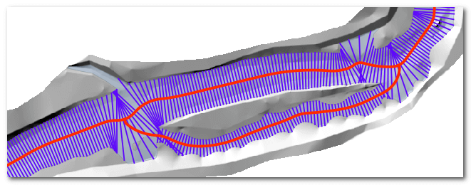

# RiverTools

This river tools repository contains scripts for generating GIS layers that represent rivers. The current tools include scripts to layout river centerlines and cross sections. These methods were conceived in collaboration between the [United States Forest Service](https://www.fs.fed.us/rmrs/), [ESSA Technologies](http://essa.com) and [North Arrow Research](http://northarrowresearch.com). These scripts are licensed as open source under [GNU Version 2.0](./LICENSE). They use open source numerical and GIS libraries and read and write data using [ShapeFiles](https://en.wikipedia.org/wiki/Shapefile) and [GeoTiffs](https://en.wikipedia.org/wiki/GeoTIFF).



The centerline and cross section scripts are both command line tools. If you just want to run the tools then refer to the Installation section below on how to use PIP. You should read the Prerequisites section and ensure that you have all the dependencies before attempting to run the tools.

## Citation

McKean, J., Nagel, D., Tonina, D., Bailey, P., Wright, C.W., Bohn, C., Nayegandhi, A., 2009. [Remote sensing of channels and riparian zones with a narrow-beam aquatic-terrestrial lidar](http://www.treesearch.fs.fed.us/pubs/34128). Remote Sensing 1:1065-1096. doi:10.3390/rs1041065.

## Installation

## Prerequisites

## Centerline

The centerline tool identifies line down the middle of a channel polygon layer. It works for both single channels and channels with islands. A [thalweg](https://en.wikipedia.org/wiki/Thalweg), or some crude representation of the main thread of the channel is required. This doesn't need to be accurate and can simply be a single line that roughly approximates the flow the channel. Refer to the [centerline tool documentation](./docs/centerline.md) for more detail.

```sh
usage: centerline.py [-h] [--smoothing SMOOTHING] [--noviz]
                     river thalweg islands centerline

positional arguments:
  river                 Path to the river shape file. Donuts will be ignored.
  thalweg               Path to the thalweg shapefile
  islands               Path to the islands shapefile (Optional).
  centerline            Path to the desired output centerline shapefile

optional arguments:
  -h, --help            show this help message and exit
  --smoothing SMOOTHING
                        smoothing "s" factor for the curve. (default=0/None)
  --noviz               Disable result visualization (faster)

```

## CrossSections

The cross section tool generates transects perpendicular to a longitudinal line down the channel. It is intended to be used *after* the centerline to produce cross sections down a channel, spanning to the edge of a channel polygon layer. The spacing of the cross sections is user-defined. Several common measurements are calculated and stored in the attribute table of the output cross section ShapeFile. Refer to the [cross section tool documentation](./docs/crosssections.md) for more detail.

```sh
usage: crosssections.py [-h] [--noviz]
                        river islands centerline dem crosssections

positional arguments:
  river          Path to the river shape file. Donuts will be ignored.
  islands        Path to the islands shapefile.
  centerline     Path to the centerline shapefile
  dem            Path to the DEM Raster (used for metric calculation)
  crosssections  Path to the desired output crosssections

optional arguments:
  -h, --help     show this help message and exit
  --noviz        Disable result visualization (faster)

```