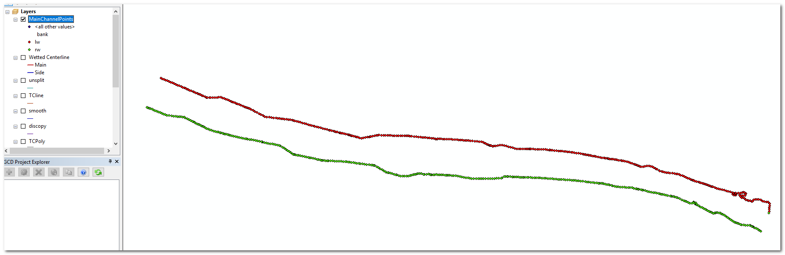
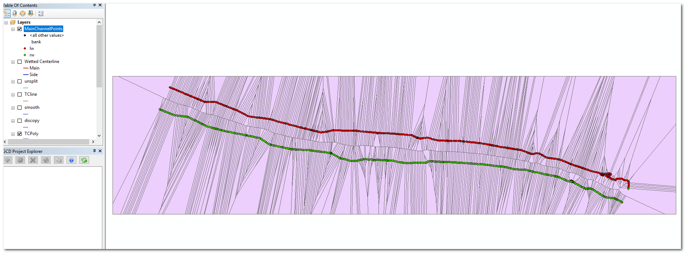
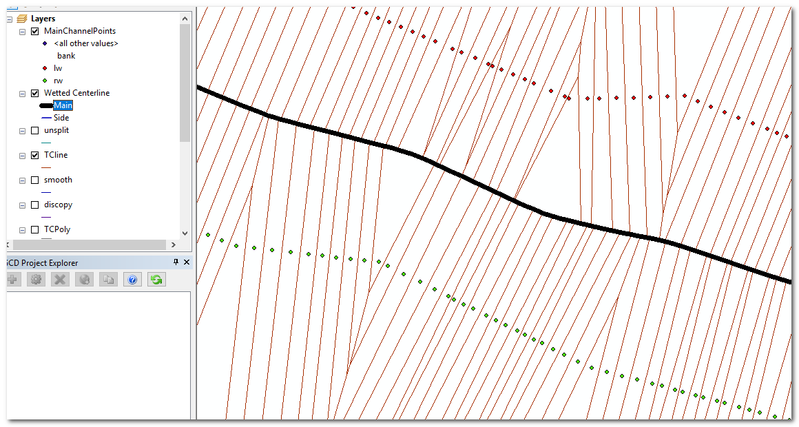
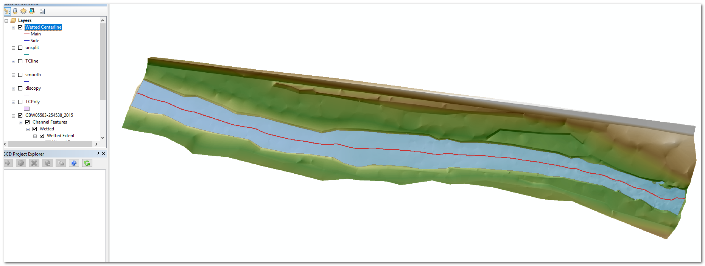
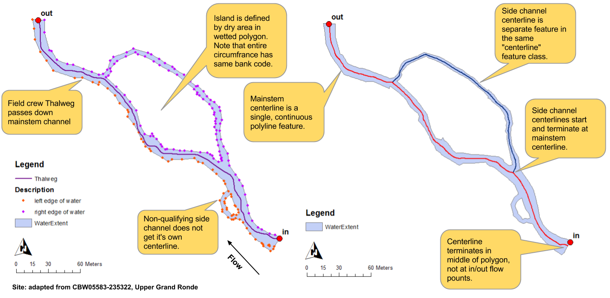

# Centerline

## Background

We use Thiessen polygons (also known as [Voronoi diagram](https://en.wikipedia.org/wiki/Voronoi_diagram)) to determine the centerline of a rivers. It's a really clever way of finding the line that is equidistant from both banks. We currently use the [ESRI Thiessen polygon geoprocessing](http://webhelp.esri.com/arcgisdesktop/9.3/index.cfm?id=1274&pid=1272&topicname=Create_Thiessen_Polygons_(Analysis)) tool.

## Objective

We need a Python routine that is capable of producing Thiessen polygons so that we can implement our centerline routine in open source GIS. There are some caveats and extra requirements that are pointed out below.

## Existing Workflow

Here's our existing centerline workflow **for single threaded channels** for some context. The screenshots are from the 2015 John Day visit 3506. Multi threaded channels are more complicated and can be worked in later.

1. Start with the polygon layer that outlines the river. (Note that the CHaMP topo toolbar performs this centerline process twice. First with the wetted and then with the bankfull polygon).
2. Convert the main channel polygon to points. i.e. create a point layer with a point at every vertex of the polygon. 
3. Use the one and only Thalweg polyline to assign points to either the left or right of the Thalweg. 
4. Generate Thiessen polygons using the points. **IMPORTANT** the ESRI tool generates the output polygons with an attribute field that contains the feature ID of the point at the center of each polygon. 
5. Explode the thieseen polygons to lines. Again, each line should possess the feature IDs of the polygon on its left and the polygon on its right.
6. Iterate over each line feature and find the polygon on the left and right of the line. Using the feature IDs mentioned in the previous two bullets, if the line divides a left bank polygon with a right bank polygon then it is a centerline feature, keep it! But if the line feature divides two left bank or two right bank features then discard it.
7. The retained features should be only the centerline lines that are equidistant from both banks.
8. [Disolve](http://pro.arcgis.com/en/pro-app/tool-reference/data-management/dissolve.htm) all the line features back together to produce a single line.
9. We normally do a little [smoothing](http://desktop.arcgis.com/en/arcmap/10.3/tools/cartography-toolbox/smooth-line.htm) on the result to ensure a natural looking line.

## Existing Code

* [Centerline Layout](https://bitbucket.org/northarrowresearch/giscode/src/7a452d0ed6c229f37fe03c7674c455ae1f4a3b96/Channel/Centerline.vb?at=RBTConsole&fileviewer=file-view-default)
* [Single Threaded Centerline Class](https://bitbucket.org/northarrowresearch/giscode/src/7a452d0ed6c229f37fe03c7674c455ae1f4a3b96/GISDataStructures/CHaMP/Centerline.vb?at=RBTConsole&fileviewer=file-view-default)
* [Multi Threaded Centerline Class](https://bitbucket.org/northarrowresearch/giscode/src/7a452d0ed6c229f37fe03c7674c455ae1f4a3b96/GISDataStructures/CHaMP/CenterlineComplex.vb?at=RBTConsole&fileviewer=file-view-default)
* [Single Wetted Extent Polygon Class](https://bitbucket.org/northarrowresearch/giscode/src/7a452d0ed6c229f37fe03c7674c455ae1f4a3b96/GISDataStructures/CHaMP/WaterExtentSinglePolygon.vb?at=RBTConsole&fileviewer=file-view-default)
* [Multi-polygon Water Extent](https://bitbucket.org/northarrowresearch/giscode/src/7a452d0ed6c229f37fe03c7674c455ae1f4a3b96/GISDataStructures/CHaMP/WaterExtentMultiPolygon.vb?at=RBTConsole&fileviewer=file-view-default)
* [Island Polygon Layer](https://bitbucket.org/northarrowresearch/giscode/src/7a452d0ed6c229f37fe03c7674c455ae1f4a3b96/GISDataStructures/CHaMP/IslandPolygons.vb?at=RBTConsole&fileviewer=file-view-default)

## Sample Data

ShapeFiles and DEM TIF for 2014 Asotin visit #2425 are attached to this card.

## Other Notes

* We often run the ESRI [Densify](http://desktop.arcgis.com/en/arcmap/10.3/tools/editing-toolbox/densify.htm) geoprocessing tool on the river bank polygon layer before this process to ensure that the polygon has lots of narrowly spaced vertices. This ensures the smoothest possible result.
* This proces can sometimes produce quirky results if the Thalweg ends in a strange place and incorrectly assigns points to either the left or right bank.

