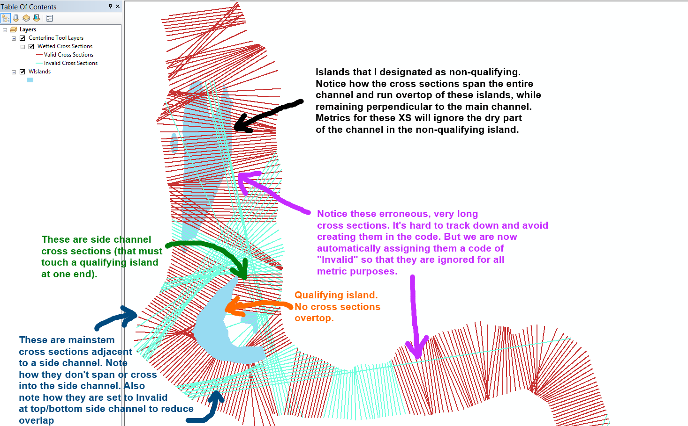
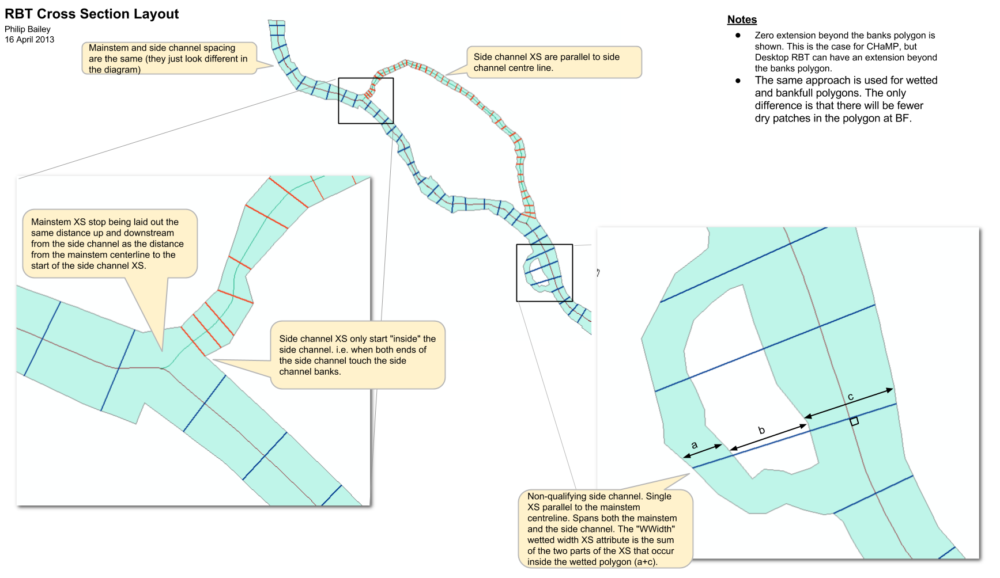

# Cross Section Layout

## Background
We lay out cross sections by extending lines at normal to the centerline. These cross sections (or transects) terminate at the water extent (either wetted or bankfull) polygon boundary.

Our existing code does this mainly using ArcObjects to traverse GIS features and create new lines where necessary. It's some of our oldest ArcGIS code! It uses lots of ArcObjects and loops rather than geoprocessing routines.

## Goal
We need a Python routine that can do the same thing.

## Existing Workflow

Our original code was written for single threaded channels. It was extended circa 2013 to layout separate cross sections for side channels and the mainstem. These channel types are identified by a field on the centerline shapefile.

Mainstem cross sections always span from one bank to either the other bank or a qualifying island. Side channel cross sections always span from either a bank to a qualifying island or qualifying island to qualifying island. Note that non-qualifying islands are removed from the wetted extent shapefile at the start of the process and completely ignored. i.e. all cross section types will span non-qualifying islands.

1. Traverse down each centerline feature (both mainstem and side channel features) from start to finish and at a specificed interal (CHaMP uses 50cm) generate what we call "seed points".
2. At each seed point generate a new line feature at normal to the centerline and extend it by some "initial length". I think the default in the code is 50m each side of the centerline.
3. Clip the initial lines to the bank polygon (either wetted or bankfull).
4. Throw away the parts of the line outside of the bank polygon.
5. Tidy up orphaned parts of the line that are inside the bank polygon but don't touch their initial seed point). These  occur in tight meanders where the initial length results in retaining more than one part of the initial line because it extends across the inside of the meander and into a different part of the channel.
6. Add an IsValid flag to every cross section and set to True.
7. Calculate the mean and standard deviation of cross section lengths. 
8. Iterate over each cross section and set its IsValid field to false if: 
   1. its length is more than 4 standard deviations from the mean length. This helps flag problem cross sections that don't approximately span the channel at right angles (because of some weird kink in the centerline).
   2. one or both ends of the cross section line are not within some tolerance of the river bank polygon (say 5cm, again because the cross section is at some weird angle and the initial length meant that the initial length didn't extend it to the banks)
   3. A mainstem cross section intersects a side channel cross section. (This occurs near confluences in areas where a tidy transect doesn't really exist and its hard to define right angles to the channel.)

## Sample Data

ShapeFiles and DEM TIF for 2014 Asotin visit #2425 are attached to the [Thiessen polygon Trello card](https://trello.com/c/RjCQq1RQ).

## Notes

* The "initial length" concept has always been problematic. Coming up with an appropriate length when CHaMP channels are all different widths is really hard. If we choose a value that's too small, many cross sections never completely span the banks polygon. A value that's too big causes the ends to re-enter the channel near meanders which creates a lot of code logic to cleanup.

